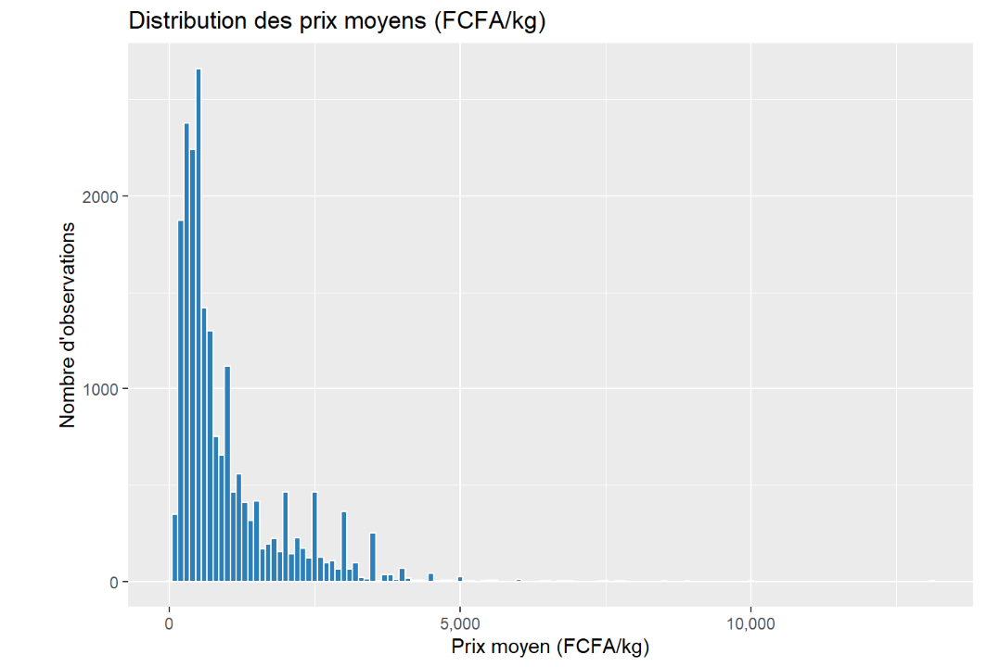

<div align="center">
# 🔍 Analyse Prix Denrées - Marchés Togolais 2026

**20 948 prix DPSSE** (Nov25-Mar26) | R/tidyverse | Portfolio

[](analyse_du_marché.html)
</div>

## 📊 Métriques clés
| Métrique | Valeur |
|----------|--------|
| **Observations** | 20 948 |
| **Période** | Nov25-Mar26 |
| **Médiane** | **600 FCFA/kg** |
| **Max** | 13 072 FCFA/kg (Fonio-Lomé) |



## 🎯 Insights
- **Grand Lomé** : +89% vs Savanes
- **Arachide/Poulet** : σ > 500 FCFA/kg
- **Sécurité alimentaire** : Protéines >1200 FCFA/kg

## 🛠️ Stack technique
```r
library(tidyverse); library(janitor)
prix_marche <- prix_marche2%>% 
  group_by(marches, produits, mois) %>% 
  summarise(prix_moy = mean(prix_moy))
```

## 🇬🇧 English Summary
**20k+ food prices analysis** | Togo markets | tidyverse | Regional disparities +89%

**KAGNIRA Bihèbè** - Data Analyst, Lomé, Togo  
[LinkedIn](https://linkedin.com/in/bihèbe-kagnira) | Masters Data France 2027

<div align="center">
[](https://creativecommons.org/licenses/by-nc-sa/4.0/)
</div>
